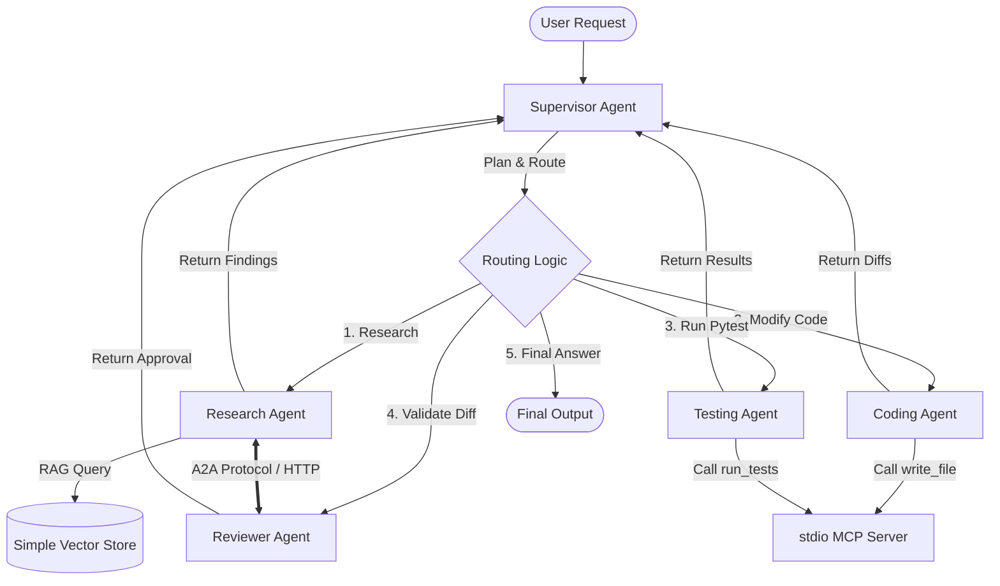

# Technical Interview Guide: Code Debug AI Agent & Team

This document is a structured guide to help you explain, defend, and discuss this project confidently in technical interviews. It is based *only* on the actual codebase implementation present in this workspace.

---

## 1. Project Summary

### What the Project Does
The project is a stateful multi-agent AI system designed to automatically analyze, debug, modify, and review codebase repositories. It orchestrates specialized subagents to locate buggy code using semantic search (RAG), apply bug fixes over standard protocols (MCP), execute test suites securely, and review diffs for regressions.

### Core Problem
Developers lose significant time in manual iteration loops: reading code, identifying files, editing code, running test suites, analyzing errors, and reviewing changes. Standard LLM wrappers fail at this because they lack state memory, struggle with context sizes, cannot interact with system files/test runners, and cannot safely review their own work in isolated environments.

### Main User Flow
1. **User Input**: A natural language goal (e.g., *"Fix the multiply bug in calculator.py and verify tests pass"*).
2. **Analysis & Planning**: The Supervisor agent assesses the goal, inspects state, and constructs/updates an execution checklist.
3. **Research**: The Research agent searches the codebase using semantic RAG to identify relevant source files and diagnose root causes.
4. **Modify Code**: The Coder agent writes target modifications and writes them to the filesystem via Model Context Protocol (MCP) file tools.
5. **Run Pytest**: The Tester agent runs the test suite (via MCP or local subprocess) to collect pass/fail results.
6. **Validate Diff**: The Reviewer agent reviews the code changes and test output to approve or reject. If rejected, it appends details to the errors list to trigger a corrective cycle.
7. **Synthesis**: Once all tasks are approved and verified, the loop terminates and the final execution report is generated.

### High-Level Architecture
The workspace contains two implementations that showcase a progression from a prototype to a mature multi-agent service team:
1. **`src/code_debug_agent` (Basic Agent)**: A simple OpenAI-based supervisor-coder-tester LangGraph loop executing external `fastmcp` stdio servers.
2. **`ai-software-engineering-team/` (Advanced Team)**: A stateful, modular Gemini-based system containing 5 agents, repository RAG, custom portable Vector Store, native MCP integration, and HTTP-based Agent-to-Agent (A2A) remote microservice delegation.

#### System Architecture Diagram (`ai-software-engineering-team`)


---

## 2. Tech Stack

### Orchestration & Routing
*   **LangGraph (`StateGraph`)**
    *   *Usage*: Manages execution state and cyclic routing.
    *   *Reason*: Standard graphs are DAGs. LangGraph allows cyclical relationships (e.g., Code $\rightarrow$ Test $\rightarrow$ Fail $\rightarrow$ Supervisor $\rightarrow$ Coder) with a central shared state (`AgentState`).
*   **LangChain**
    *   *Usage*: Models integration, ChatPromptTemplate formatting, and structured output parsing.
    *   *Reason*: Simplifies prompt pipelines and provides native support for Pydantic schema validation using `with_structured_output`.

### LLM & Embeddings
*   **Google Gemini (`gemini-1.5-flash` via `langchain-google-genai`)**
    *   *Usage*: Underlying reasoning engine driving the Supervisor and all subagents.
    *   *Reason*: Large context window, fast speed, low latency, and native support for structured JSON schemas.
*   **Google Generative AI Embeddings (`models/text-embedding-004`)**
    *   *Usage*: Generates vector representations of codebase chunks.
    *   *Reason*: High-quality code representation and native compatibility with Gemini API.

### Database & Storage
*   **SimpleVectorStore (Custom Python / NumPy)**
    *   *Usage*: Custom in-memory and pickle-serialized vector database fallback.
    *   *Reason*: Windows SQLite conflicts frequently cause native C++ binary crashes in Chroma. A custom pure-python fallback using `numpy` cosine similarity calculation guarantees cross-platform execution.
*   **ChromaDB**
    *   *Usage*: Standard native vector storage for semantic retrieval on non-Windows platforms.
    *   *Reason*: Fast vector index query capabilities using cosine distance workspace matching.

### Protocols & Frameworks
*   **Model Context Protocol (MCP)**
    *   *Usage*: Standardized API interface for filesystem read/write and pytest commands.
    *   *Reason*: Decouples tool execution from agent definitions. Enforces standard input boundaries to prevent shell injections and directory escaping.
*   **FastAPI / HTTP (Agent-to-Agent - A2A)**
    *   *Usage*: Lightweight remote microservice server allowing independent agents to act as distributed nodes.
    *   *Reason*: Enables microservice modularity. Agents like `researcher` and `reviewer` can run as separate networked web applications, falling back to local nodes if offline.

---

## 3. Module Overview

### `ai-software-engineering-team/` (Core Multi-Agent Service)

*   [`app/state.py`](file:///d:/code-debug-ai-agent/ai-software-engineering-team/app/state.py)
    *   *Purpose*: Defines `AgentState` schema and initialization helper.
    *   *Responsibility*: Houses planning checklist, completed tasks, outputs (research, code changes, test results, review), errors accumulator list, and routing indicators.
*   [`app/graph/workflow.py`](file:///d:/code-debug-ai-agent/ai-software-engineering-team/app/graph/workflow.py)
    *   *Purpose*: Configures the LangGraph orchestration flow.
    *   *Responsibility*: Registers node functions (agents) and defines conditional edges returning to the supervisor.
*   [`app/graph/routing.py`](file:///d:/code-debug-ai-agent/ai-software-engineering-team/app/graph/routing.py)
    *   *Purpose*: Contains conditional execution path routers.
    *   *Responsibility*: Directs to subagents based on state variables and halts infinite loops using a hard `MAX_ITERATIONS` budget check.
*   [`app/agents/supervisor.py`](file:///d:/code-debug-ai-agent/ai-software-engineering-team/app/agents/supervisor.py)
    *   *Purpose*: Central coordinator agent.
    *   *Responsibility*: Evaluates the current execution status and uses structured JSON output to update the task checklist and set the next subagent.
*   [`app/agents/research_agent.py`](file:///d:/code-debug-ai-agent/ai-software-engineering-team/app/agents/research_agent.py)
    *   *Purpose*: Codebase scanner and bug locator.
    *   *Responsibility*: Queries the vector database using RAG, maps file structure, and suggests high-level implementation fixes.
*   [`app/agents/coding_agent.py`](file:///d:/code-debug-ai-agent/ai-software-engineering-team/app/agents/coding_agent.py)
    *   *Purpose*: File editor.
    *   *Responsibility*: Generates full file replacement code and writes changes safely to the filesystem using MCP tool commands.
*   [`app/agents/testing_agent.py`](file:///d:/code-debug-ai-agent/ai-software-engineering-team/app/agents/testing_agent.py)
    *   *Purpose*: Code validation.
    *   *Responsibility*: Triggers pytest through the MCP server or falls back to direct local subprocess execution if MCP is offline.
*   [`app/agents/reviewer_agent.py`](file:///d:/code-debug-ai-agent/ai-software-engineering-team/app/agents/reviewer_agent.py)
    *   *Purpose*: Quality gatekeeper.
    *   *Responsibility*: Audits code changes and test outputs to emit a boolean approval result.
*   [`app/mcp/tools.py`](file:///d:/code-debug-ai-agent/ai-software-engineering-team/app/mcp/tools.py)
    *   *Purpose*: Backend execution engine.
    *   *Responsibility*: Implements path traversal validation and parses pytest options safely without shell shell execution limits.
*   [`app/a2a/server.py`](file:///d:/code-debug-ai-agent/ai-software-engineering-team/app/a2a/server.py) / [`app/a2a/client.py`](file:///d:/code-debug-ai-agent/ai-software-engineering-team/app/a2a/client.py)
    *   *Purpose*: Agent-to-Agent remote execution.
    *   *Responsibility*: Exposes research and reviewer endpoints via FastAPI, checks capability schemas, and executes nodes over HTTP.
*   [`app/rag/vector_store.py`](file:///d:/code-debug-ai-agent/ai-software-engineering-team/app/rag/vector_store.py)
    *   *Purpose*: Vector search and storage.
    *   *Responsibility*: Indexes repository files and serves similarity search queries. Wraps the pure-python custom fallback.
*   [`app/utils/logging.py`](file:///d:/code-debug-ai-agent/ai-software-engineering-team/app/utils/logging.py)
    *   *Purpose*: Central execution tracer.
    *   *Responsibility*: Formats elapsed timings and tool outputs into a markdown execution summary.

### `src/code_debug_agent/` (Prototype OpenAI Codebase)
*   [`graph.py`](file:///d:/code-debug-ai-agent/src/code_debug_agent/graph.py): Basic StateGraph routing loop.
*   [`mcp_client.py`](file:///d:/code-debug-ai-agent/src/code_debug_agent/mcp_client.py): Configures `MultiServerMCPClient` to launch separate Python command servers.
*   [`mcp_servers/`](file:///d:/code-debug-ai-agent/mcp_servers/): Independent servers (`coding_server.py` and `testing_server.py`) exposing basic filesystem and command tools.

---

## 4. Critical Deep Dives

### A2A Remote Service Protocol
*   **What it does**: Exposes agents as independent services over HTTP endpoints.
*   **How it works**: The Research and Reviewer agents can run inside separate FastAPI processes (listening on ports `8001` and `8002`). When the main graph executes the local agent nodes, it queries the endpoint `GET /capabilities`. If responsive, the local node wraps `AgentState` in a `A2ATaskRequest` and POSTs it to `POST /execute` to perform remote work. If the endpoint is down, it prints a debug line and executes local functions as fallback.
*   **Why designed this way**: In production, security and hardware constraints dictate that heavy tasks (like GPU-based inference or massive codebase RAG queries) should run on separate machines, away from the lightweight coordinator engine.
*   **Failure handling**: Complete failover logic: `requests.post()` errors are caught, reverting execution gracefully to local node calculations.

### SimpleVectorStore: Portable Pure-Python Fallback
*   **What it does**: Custom database to avoid compiled SQLite/Chroma compilation conflicts.
*   **How it works**: Uses NumPy arrays to calculate cosine similarity:
    $$\text{Similarity} = \frac{\mathbf{q} \cdot \mathbf{i}}{\|\mathbf{q}\| \|\mathbf{i}\|}$$
    It serializes vector records as simple binary dictionaries via python `pickle`. If `os.name == "nt"` (Windows), or if the environment variable `VECTOR_DB_BACKEND` is set to `"simple"`, the system instantiates `SimpleVectorStore` instead of `chromadb.PersistentClient`.
*   **Why designed this way**: Chroma SQLite configurations trigger process memory access violations on Windows. Designing a NumPy-based fallback guarantees developers can run RAG testing locally without crashes.
*   **Optimization**: Generates deterministic mock embedding vectors (768 dimensions) by seeding standard MD5 hash seeds to the random generator if the user has not configured `GOOGLE_API_KEY`, allowing completely offline, cost-free regression testing.

### Secure Model Context Protocol File/Test Boundary
*   **What it does**: Enforces isolation on filesystem and command runners.
*   **How it works**: 
    1.  *Path Traversal Block*: Every file read/write resolves the requested path against the workspace path:
        ```python
        resolved_target = Path(path).resolve()
        if not resolved_target.is_relative_to(resolved_root.resolve()):
            raise ValueError("Path traversal detected!")
        ```
    2.  *No Arbitrary Command Injection*: Instead of exposing a raw shell runner (like `shell=True` subprocesses or the insecure `run_command` in `testing_server.py`), the secure `run_tests` tool strictly constructs execution parameters:
        ```python
        cmd = [sys.executable, "-m", "pytest", "-v"]
        ```
        It tokenizes inputs using `shlex.split`, ignores command prefix injections (`pytest` or `python -m`), and validates target file arguments against the path traversal check.
*   **Why designed this way**: A naive agent can easily run malicious code, write to critical system directories, or execute destructive commands (like `rm -rf /`). Enforcing strict relative boundaries guarantees safety.

---

## 5. Interview Questions

### A. Basic Explanation Questions
*   **Walk me through the architecture of your system.**
    *   *Answer*: The system is built on LangGraph as a cyclic orchestration engine. The central node is the Supervisor. It uses Gemini to analyze the user request and generate a structured plan. It routes execution sequentially: first to the Research agent (which pulls code via RAG), then to the Coding agent (which applies modifications via MCP), then to the Testing agent (which validates the fix), and finally to the Reviewer agent. If tests or reviews fail, it routes back to the Supervisor to revise the plan and try again, up to a maximum iteration limit.
*   **How does the agent locate code inside the workspace?**
    *   *Answer*: It uses a custom RAG index. The Research agent scans the workspace, ignores system/venv files, recursively splits text using `RecursiveCharacterTextSplitter`, generates 768-dimensional embeddings using Gemini (or a deterministic hash-based generator if offline), and indexes them. When a query is run, it performs cosine similarity matching to return the top 5 most relevant code blocks.

### B. Why / Design Questions
*   **Why did you use LangGraph instead of a standard LangChain agent or simple sequential code script?**
    *   *Answer*: Sequential scripts cannot handle complex bug fixing because code fixes frequently fail tests, requiring iterative correction. LangGraph allows cyclical routing, meaning we can retry loops. Standard agents using ReAct loops are too chaotic for software engineering teams; separating roles into distinct nodes (Research, Coding, Testing, Reviewer) makes the system predictable, testable, and easier to monitor.
*   **Why use FastAPI / HTTP for A2A communication instead of keeping all agents in the same local execution loop?**
    *   *Answer*: It mirrors microservice development. In a real-world enterprise system, RAG querying or code compilation might need specialized GPU instances, security restrictions, or isolated container setups. A2A over HTTP decouples agents, allowing independent scaling, separate deployment, and specialized runtime environments.
*   **Why did you implement a custom Vector Database fallback?**
    *   *Answer*: Chroma DB relies on native binary bindings. On Windows, compiling and loading these binaries often leads to SQLite database lockups and access violations. To guarantee portability and stability across developer machines, I wrote `SimpleVectorStore` in pure python using NumPy for similarity search and `pickle` for persistence.

### C. Module-Specific Questions
*   **In `testing_agent.py`, how is reliability guaranteed if the MCP server is down or unresponsive?**
    *   *Answer*: The `testing_node` wraps the MCP server client tool call in a `try/except` block. If the call fails, it automatically reverts to running local tests using `run_tests_subprocess(repo_path)`. This runs `pytest` directly via python's `subprocess` module in the local environment, ensuring that the execution graph completes even with disconnected services.

### D. Failure / Edge-Case Questions
*   **What happens if the model gets stuck in an infinite loop correcting the same test failure?**
    *   *Answer*: In [`routing.py`](file:///d:/code-debug-ai-agent/ai-software-engineering-team/app/graph/routing.py), we check `state.iteration_count` against `MAX_ITERATIONS = 10`. If the loop exceeds 10 iterations, routing bypasses all agents and goes directly to the `final_response` node to terminate, returning the execution steps to the user without wasting tokens.
*   **What happens if there are no tests in the target workspace?**
    *   *Answer*: In [`testing_agent.py`](file:///d:/code-debug-ai-agent/ai-software-engineering-team/app/agents/testing_agent.py#L141-L144), if the pytest execution output reveals that no tests were collected, the agent automatically marks the outcome as `success = True` and sets the summary to *"No tests found in repository (Auto-passed validation)"*. This prevents the system from getting blocked when debugging workspaces without test suites.

### E. Tricky / Twist Questions
*   **Is this system actually production-secure? If I point this agent to a repository, can it run malicious code?**
    *   *Answer*: The `ai-software-engineering-team/` codebase has security controls like path traversal checks and parameter validation. However, **it is not production-secure against arbitrary code execution**. Pytest itself executes python code at import time (like `conftest.py` files). If a malicious user supplies a repository containing a backdoor inside `conftest.py`, running the test runner executes that backdoor directly on the host machine. In production, the test execution must be isolated in a Docker container or gVisor sandbox.
*   **Why did you use full file replacements in `coding_agent.py` instead of generating diff patches (like Unified Diffs or line-by-line insertions)?**
    *   *Answer*: Writing whole files avoids formatting and line matching errors common with LLMs. However, it's a trade-off: for large files, writing the entire content back consumes excessive tokens and risk truncating the file if the model hits token limits. A better approach for production would be block-based editing or unified patch generation.
*   **How does the system prevent the Supervisor from repeating the same failed plan over and over?**
    *   *Answer*: The Supervisor node doesn't just read the user task; it receives the updated `errors`, `research_results`, `code_changes`, and `test_results` in the user prompt. Since these inputs accumulate in the LangGraph state, the model is fully aware of what was attempted and why it failed, allowing it to formulate a different correction strategy.
*   **If your custom vector store uses pickle to serialize vectors, isn't that a massive security risk?**
    *   *Answer*: Yes. Python's `pickle` module is vulnerable to arbitrary code execution if loading untrusted files. While acceptable for a prototype running on trusted local workspaces, a production version must use secure formats (like JSON or Parquet) or rely on standard Vector Databases like pgvector or Qdrant.

---

## 6. Scalability & Design

### Current Scalability Bottlenecks
*   **LLM Latency & Cost**: Sequentially calling `gemini-1.5-flash` multiple times per task loop is slow.
*   **Memory Footprint**: The custom `SimpleVectorStore` loads all vectors into memory and performs brute-force dot products. While fast for small repos (e.g. 100 chunks), it will freeze with repositories containing thousands of source files.
*   **Lack of Isolation**: Subprocess execution runs on the local host machine, locking resources and risking filesystem race conditions.

### Scaling Scenarios
*   **10 Users**: Works without issues. High latency (30-40 seconds per run) but no resources are choked.
*   **1,000 Users**: Will trigger LLM rate limits. Parallel runs will corrupt files since the local `WORKSPACE_ROOT` is hardcoded per configuration.
*   **100,000 Users**: Will crash the server. Local file system collisions, memory starvation due to loaded NumPy arrays, and massive token costs.

### Production Improvements
1.  **Containerized Sandboxing**: Boot a temporary, isolated Docker container or microVM (like AWS Firecracker) per user request to isolate file writes and test runs.
2.  **Task Queue Orchestration**: Wrap LangGraph runs in Celery or temporal tasks, separating worker queues for LLM reasoning and file compilation.
3.  **HNSW Indexing / Vector database**: Swap `SimpleVectorStore` for a production-grade database (like Qdrant or Milvus) to query dense embeddings in sub-millisecond times.

---

## 7. Strong Answers

### Explain Your Project (45-60s)
> *"I built a stateful multi-agent AI system designed to automatically analyze and fix buggy codebases. It is built on LangGraph to manage cyclic validation loops. The system orchestrates five specialized agents: a Supervisor that handles planning, a Researcher that pulls relevant context using semantic search (RAG), a Coder that edits files over Model Context Protocol (MCP), a Tester that runs pytest, and a Reviewer that validates the edits. It handles real-world challenges by utilizing a fallback vector database on Windows, catching subprocess test failures, and guarding against path traversal attacks."*

### Explain the Architecture (30-45s)
> *"The core is a StateGraph containing specialized agent nodes. Each agent writes its findings back to a central shared AgentState. Instead of a linear sequence, the system utilizes conditional routing. Subagents execute their tasks and return to the Supervisor. If testing fails, the Supervisor detects the test error logs in the State, updates the checklist, and sends it back to the Coder for a retry, halting immediately if it exceeds the loop threshold."*

### Biggest Technical Challenge
> **Challenge**: Chroma DB's underlying SQLite C-extensions caused random access violations and segmentation faults on Windows, causing the system to crash.
> **Solution**: I designed a custom portable vector database class, `SimpleVectorStore`, in pure Python. It uses NumPy to calculate cosine similarity manually and persists indexes using pickle files. I wrapped both databases in a coordinator class that detects the OS platform: it automatically spins up `SimpleVectorStore` on Windows systems and runs native Chroma on Linux/macOS. This made the repository completely portable and cross-platform.

---

## 8. Weak Points

### 1. Insecure Code Execution in Host Environment
*   **Problem**: Running pytest executes python test files directly on the host machine.
*   **Why it matters**: A user could inject malicious code in test files to steal API keys or compromise the environment.
*   **Improvement**: Execute all MCP operations inside temporary Docker sandboxes.

### 2. Full File Replacement Strategy
*   **Problem**: The Coding agent replaces the entire file content instead of applying diff patches.
*   **Why it matters**: For large files, this consumes massive token limits and risks rewriting correct code blocks.
*   **Improvement**: Modify the Coder prompt and tools to support Unified Diffs or line-targeted edits.

### 3. Pickle Deserialization Risk
*   **Problem**: `SimpleVectorStore` loads indexes using python's `pickle.load()`.
*   **Why it matters**: If a malicious user replaces the database file, loading it can trigger remote code execution.
*   **Improvement**: Use `json` or a flat file format (like parquet) to store vectors.

---

## 9. Interview Cheat Sheet

### 10 Things You MUST Know
1.  **Cyclic Orchestrator**: LangGraph manages cyclic code-testing-review loops.
2.  **Shared State**: State is tracked using the central `AgentState` TypedDict.
3.  **Structured Output**: LLM outputs are validated against Pydantic schemas using `with_structured_output`.
4.  **A2A Protocol**: Research and Reviewer agents can run as independent web services via FastAPI.
5.  **MCP Interface**: The Coder edits code and the Tester runs pytest via standard stdio MCP channels.
6.  **Path Traversal Prevention**: Every file tool uses `.resolve()` and `.is_relative_to()` to block directory escapes.
7.  **Custom Vector Store**: Pure Python/NumPy database serves as a fallback on Windows.
8.  **Mock Fallback**: Offline mode runs via deterministic mock embeddings generated from MD5 text seeds.
9.  **Subprocess Fallback**: The Testing agent automatically runs direct subprocesses if the MCP client fails.
10. **Loop Protection**: Maximum iterations are capped at 10 to prevent token wasting.

### 5 Numbers / Facts worth Remembering
*   **`10`**: Maximum loop iteration threshold (`MAX_ITERATIONS`).
*   **`768`**: Size of vector dimensions used by `MockEmbeddings`.
*   **`8001 / 8002`**: Default ports used by Research and Reviewer FastAPI A2A services.
*   **`gemini-1.5-flash`**: Default LLM reasoning model.
*   **`30 seconds`**: Maximum timeout enforced on subprocess test runs.

### 5 Architecture Keywords
*   **Stateful Routing**
*   **Model Context Protocol (MCP)**
*   **Agent-to-Agent (A2A) Microservices**
*   **Retrieval-Augmented Generation (RAG)**
*   **Type Narrowing / Discrimination**

### 5 Mistakes NOT to Make
1.  **Claiming the system is secure**: Pytest execution on the host machine is insecure. Confidently acknowledge this and explain how sandboxing fixes it.
2.  **Claiming SQLite is used on Windows**: Explain that you bypass SQLite/Chroma conflicts on Windows using the `SimpleVectorStore` fallback.
3.  **Claiming LangGraph uses native parallel execution**: Explain that the graph runs nodes sequentially, returning to the Supervisor at each step.
4.  **Confusing the two codebases**: Clearly distinguish the simple OpenAI demo (`src/code_debug_agent`) from the advanced Gemini team (`ai-software-engineering-team/`).
5.  **Saying the agent generates diffs**: Explain that the Coding agent currently does full file overwrites via the `write_file` MCP tool.

---

## 10. Project Flow in One Page

```
User Goal (Request + Repo Path)
      ↓
Supervisor (Generates plan checklist via structured output)
      ↓
Research Agent
   ├─► Check A2A (HTTP Port 8001)
   ├─► Fallback Local RAG (Chroma/SimpleVectorStore)
   └─► Output: Root cause + Suggested fix
      ↓
Supervisor (Reads results, updates checklist)
      ↓
Coding Agent
   ├─► Proposes CodeChange (Pydantic model)
   ├─► Resolves & validates relative file path (Blocks traversal)
   └─► Writes code via MCP tool "write_file" (Full rewrite)
      ↓
Supervisor (Reads results, updates checklist)
      ↓
Testing Agent
   ├─► Runs "run_tests" MCP tool
   ├─► Fallback: Direct python subprocess run (Timeout = 30s)
   └─► Output: Stdout/Stderr logs
      ↓
Supervisor (Reads logs, updates checklist)
      ↓
Reviewer Agent
   ├─► Check A2A (HTTP Port 8002)
   ├─► Local check: Audits diff & test outcome
   └─► Output: Approved (True/False) + Feedback
      ↓
Supervisor (Inspects review. If False, updates plan & retries; if True, ends loop)
      ↓
Final Output (Synthesized report + Execution steps tracer)
```
