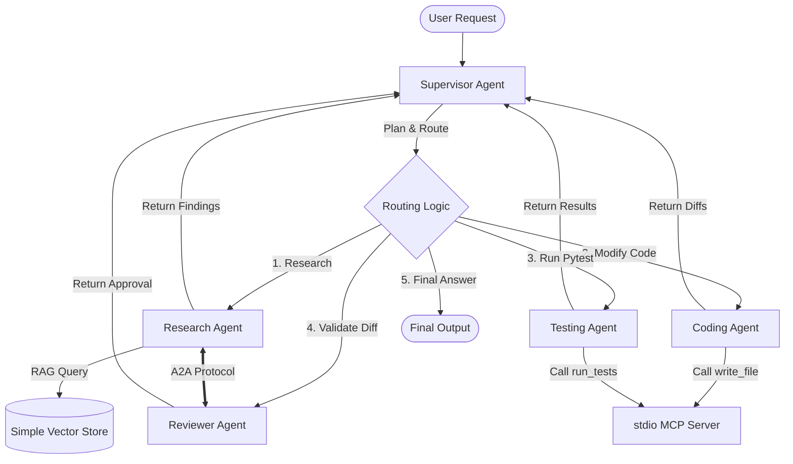

# AI Software Engineering Team

A state-of-the-art Multi-Agent AI system designed to automatically analyze, debug, modify, and review codebase repositories. Built from scratch to demonstrate advanced Agentic AI workflows, it uses stateful routing, standardized tool access (MCP), independent microservices (A2A), and repository-aware RAG.

---

## 1. Problem
Debugging and adding features to modern codebases requires developers to read code, locate buggy files, formulate fixes, write edits, run test suites, and review modifications for regressions. Traditional AI tools (like simple chat wrappers) fail at this because they lack state memory, struggle with repository context sizes, cannot interact with standard system tools, and cannot safely review their own work in isolated environments.

## 2. Solution
The **AI Software Engineering Team** models a real-world software team. An orchestrating Supervisor agent plans tasks and delegates work to four specialized subagents. The subagents utilize semantic retrieval (RAG) to locate files, call filesystem and testing tools securely via standard protocols, and validate implementation results.

---

## 3. Architecture



### Protocol Breakdowns
- **MCP (Model Context Protocol)**: Standardizes how the Coding and Testing agents communicate with tools (file operations, running tests) in an isolated project boundary.
- **A2A (Agent-to-Agent)**: Enables independent remote agent microservices (Research and Reviewer) to collaborate and execute subtasks over standard HTTP endpoints.

---

## 4. Interview Cheat Sheet: "What does each technology do?"

### LangGraph
- **Role**: Workflow Orchestration, Routing, and State.
- **Explanation**: LangGraph manages the stateful agent execution graph, orchestrating the transitions between the Supervisor and the subagents, keeping track of task completion, and enforcing loop safety boundaries.

### LangChain
- **Role**: Model integration, prompts, and structured output.
- **Explanation**: LangChain provides prompt templates, wraps the Gemini LLM, and enforces strict schemas on agent responses using Pydantic structured output models.

### RAG (Retrieval-Augmented Generation)
- **Role**: Codebase context retrieval.
- **Explanation**: Instead of feeding the entire repository into the model's context window, RAG queries a semantic database to fetch only the relevant code chunks.

### Vector Database
- **Role**: Storage and semantic lookup of embeddings.
- **Explanation**: Indexes the repository chunks as float vectors and retrieves the top-K chunks using cosine similarity calculation.

### MCP (Model Context Protocol)
- **Role**: Safe agent-to-tool interface.
- **Explanation**: Enforces standard boundaries for file read/write and pytest commands. The server prevents path traversal and blocks arbitrary shell command injections.

### A2A (Agent-to-Agent)
- **Role**: Remote agent-to-agent messaging.
- **Explanation**: Allows agents to run as independent web services that advertise capabilities and exchange state messages over HTTP.

### Subagents
- **Role**: Specialized execution roles.
- **Explanation**: Breaking down a complex problem into modular roles (Research, Coding, Testing, Reviewer) improves reasoning and debugging accuracy.

### Gemini (LLM)
- **Role**: Reasoning engine.
- **Explanation**: Drives supervisor decision-making and subagent outputs.

---

## 5. Security Model
- **Workspace Isolation**: All tools and file writers resolve paths relative to a configured `WORKSPACE_ROOT`.
- **Path Traversal Prevention**: Absolute and relative paths are normalized and validated to ensure they start with the workspace root directory.
- **No Arbitrary Execution**: The test execution tool is hardcoded to run python's pytest module, preventing arbitrary bash commands.

---

## 6. Setup & Installation

### Prerequisite
Python 3.10+ installed.

### 1. Install Dependencies
Install dependencies and build the package in editable mode:
```bash
pip install -e .
```

### 2. Configure Environment
Copy and populate `.env`:
```bash
cp .env.example .env
```
Ensure you set your `GOOGLE_API_KEY` (Gemini API Key).

---

## 7. Running the Demo

Give the agent a buggy file. It will **analyze → debug/modify → test → review**:

```bash
python main.py demo_workspace/calculator.py
```

Or pass an extra goal with the file:

```bash
python main.py demo_workspace/samples/codeWrongpy.py "fix the broken add/multiply/subtract functions"
```

You can still pass a natural-language goal that names the file:

```bash
python main.py "Fix the multiply bug in calculator.py and verify tests pass"
```

To run the remote A2A services:
```bash
python app/a2a/server.py 8001  # Research A2A Service
```
And:
```bash
python app/a2a/server.py 8002  # Reviewer A2A Service
```

---

## 8. Running the Tests
To run the test suite (20 unit/integration tests verifying graph, RAG, MCP, and A2A):
```bash
pytest
```

---

## 9. Limitations & Future Scope
- **Synchronous Graph**: The graph runs nodes sequentially. Multi-threading parallel subtasks is a future scope.
- **Mock Fallback**: Runs deterministic mock operations if API keys are missing to ensure testing is possible without online costs.
